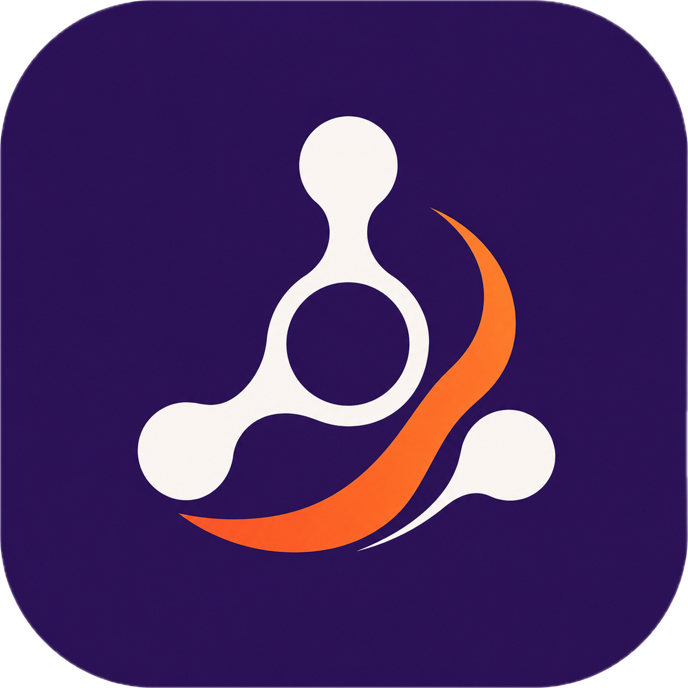

<p align="center">
  
</p>

<h1 align="center">DeepAgents</h1>

<p align="center">
  <a href="https://deepagents-swift.verybad.engineer"></a>
  
  
  
  
</p>

<p align="center">
  An inference-agnostic agent framework for Swift: a ReAct loop, a composable middleware
  system, an MCP client, and generic toolsets, with adapters for on-device MLX, OpenAI,
  Anthropic, and macOS.
</p>

---

## Products

| Product | What it is | Dependencies |
|---------|------------|-------------|
| `DeepAgents` | ReAct loop, middleware, MCP client, toolsets, lazy tool search | Foundation + MCP only |
| `DeepAgentsMLX` | On-device inference + ColBERT tool retrieval via MLX | MLX, Tokenizers |
| `DeepAgentsOpenAI` | OpenAI-compatible chat-completions (also Azure) | URLSession only |
| `DeepAgentsAnthropic` | Anthropic Messages + AWS Bedrock (SigV4) | CryptoKit only |
| `DeepAgentsMacTools` | macOS tools: screenshot, clipboard, Apple Notes, CLI | AppKit, ScreenCaptureKit |

The core `DeepAgents` target carries no MLX and no AppKit dependency. A CI guard enforces this
so the framework can be retargeted to any backend by writing a single `ChatModel` conformance.

**Lazy tool loading.** Tools can be tiered *core* (schema in the prompt) or *auxiliary* (found on
demand via a `search_tools` tool, then called normally). The rendered tool set never changes, so
discovering a tool costs no prompt re-prefill - which is what makes it usable with an on-device
prefix KV cache. Retrieval is pluggable: a lexical retriever needs no model, and
`ColBERTToolRetriever` (in `DeepAgentsMLX`) runs LFM2.5-ColBERT-350M late interaction on device. See
[Middleware](https://deepagents.verybad.engineer/concepts/middleware/).

## Requirements

- macOS 26+
- Swift 6.1+ (Swift 6 language mode)

## Install

```swift
.package(url: "https://github.com/dsaad68/deepagents-swift.git", from: "0.2.3")
```

Then depend on the products you need:

```swift
.product(name: "DeepAgents", package: "deepagents-swift"),
.product(name: "DeepAgentsAnthropic", package: "deepagents-swift")
```

## Docs

Full documentation at [deepagents-swift.verybad.engineer](https://deepagents-swift.verybad.engineer).

## License

MIT. See `LICENSE`.
