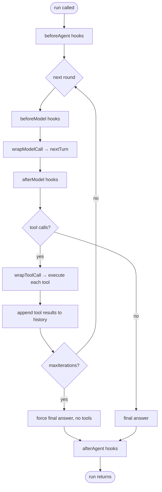

# Architecture

This page explains the structural decisions behind DeepAgents: why the `ChatModel` abstraction exists where it does, why sessions are stateless, how the five library products are layered, and how the ReAct loop fits everything together.

!!! info "Lineage"
    DeepAgents is heavily inspired by [LangChain's Deep Agents](https://github.com/langchain-ai/deepagents) framework - the planning / filesystem / subagent "pillars" and the middleware-driven design follow its model, reimagined in Swift with an inference-agnostic `ChatModel` seam and first-class on-device (MLX) support.

## Inference-agnostic design

DeepAgents decouples agent logic from the inference backend through a single protocol:

```swift
public protocol ChatModel: Sendable {
    var supportsVision: Bool { get }
    var modelID: String? { get }
    var contextWindowTokens: Int? { get }
    func makeSession() -> any ModelTurnSession
}
```

A `ChatModel` is a stateless factory. It knows how to create a session but holds no conversation state itself. The agent calls `model.makeSession()` exactly once per `run(...)` call; that session object is scoped to that run and discarded when the run ends.

The protocol deliberately exposes nothing about the backend: no HTTP client, no token type, no sampling parameter. Every adapter - MLX, OpenAI, Anthropic, Bedrock - hides its wire format behind `makeSession()`. Retargeting your agent to a different backend is one substitution at the call site where the `ChatModel` is constructed.

## The stateless ModelTurnSession

```swift
public protocol ModelTurnSession: AnyObject {
    func nextTurn(
        messages: [AgentMessage],
        systemPrompt: String?,
        tools: [any AgentTool],
        onChunk: @escaping @Sendable (AgentStreamChunk) -> Void
    ) async throws -> AgentMessage
}
```

Each call to `nextTurn` receives the **full conversation history** as a `[AgentMessage]` array and generates exactly one assistant turn. There is no incremental history managed inside the session; the prompt is rebuilt from messages on every round.

This design has two important consequences:

1. **Middleware can freely rewrite history.** `wrapModelCall` receives a `ModelRequest` that carries `messages`, `systemPrompt`, and `tools`. Middleware can insert, remove, or transform messages before they reach the backend on every round. A summarization middleware, for example, can replace a large history slice with a compact summary without the session ever knowing.

2. **`wrapModelCall` can retry safely.** Because there is no live KV cache to keep in sync, a middleware that catches a rate-limit error can re-issue the identical `nextTurn` call without inconsistency. The rebuild is idempotent from the backend's perspective.

The trade-off is that there is no persistent KV cache reuse across rounds. For on-device MLX inference this matters; the framework compensates through `SummarizationMiddleware`, which compacts history at around 85% of the context window to stay within bounds.

Each adapter implements a message codec (`MessageCodec`) that translates `AgentMessage` values into the backend's native wire format. The core framework never sees provider-specific types; the codec is the only place where `AgentMessage.Role` maps to, say, an Anthropic `role: "user"` or an OpenAI `role: "user"`.

## The ReAct loop

The loop is implemented in `ReactAgent`. After constructing one `ModelTurnSession` for the run, it iterates rounds until a stopping condition is reached:



Stopping conditions:

- The model produces a response with no tool calls - the run ends successfully.
- `maxIterations` is reached - the framework re-calls the model with tools removed from the prompt, forcing a final prose answer, then exits.
- An unrecoverable error is thrown - surfaced as an `.failed` event; `run` returns `false`.

A duplicate-round guard detects when two consecutive rounds produce identical tool calls with identical arguments and skips the repeat, preventing infinite loops from prompt-confused models.

Middleware hooks nest around the core loop. `wrapModelCall` and `wrapToolCall` wrap in registration order: the first-registered middleware is the outermost wrapper. `beforeAgent`/`afterAgent` fire once per run; `beforeModel`/`afterModel` fire once per round.

## The 5 products and dependency boundaries

```
DeepAgents (core)
 ├── Foundation
 └── swift-sdk (MCP)

DeepAgentsMLX
 ├── DeepAgents
 ├── mlx-swift-lm  (MLX, metal, Tokenizers)
 └── swift-huggingface

DeepAgentsOpenAI
 ├── DeepAgents
 └── URLSession (in Foundation)

DeepAgentsAnthropic
 ├── DeepAgents
 └── CryptoKit (SigV4 for Bedrock)

DeepAgentsMacTools
 ├── DeepAgents
 ├── AppKit
 └── ScreenCaptureKit
```

The hard rule: no `import MLX` and no `import AppKit` under the `DeepAgents` core target. This is enforced by a CI guard script (`Scripts/check-framework-imports.sh`, run via `just guard`). The guard fails the build if either import appears in core sources. In practice this means any code that conditionally uses MLX or AppKit must live in the relevant adapter product, not in core.

For code that is shared between an app target and a CI/server target, use a conditional import:

```swift
#if canImport(DeepAgentsMLX)
import DeepAgentsMLX
#endif
```

## Per-adapter message codecs

Each adapter ships a `MessageCodec` implementation that translates the framework's `AgentMessage` type to and from the backend's wire format:

| Adapter | Codec | Notes |
|---|---|---|
| `DeepAgentsMLX` | `LFM2MessageCodec` | Applies the LFM2 chat template; custom `<\|tool_call_start\|>...<\|tool_call_end\|>` parser that preserves nested arrays/objects (the built-in mlx-swift-lm parser truncates at the first comma) |
| `DeepAgentsOpenAI` | `OpenAIMessageCodec` | Standard OpenAI messages array; `reasoning: true` requests streamed chain-of-thought |
| `DeepAgentsAnthropic` | `AnthropicMessageCodec` | Anthropic `content` block format; reused by `BedrockChatModel` (same wire format, different transport and auth) |

The codec is an internal implementation detail of each adapter. The core framework interacts only with `AgentMessage` and `AgentStreamChunk` values.

## Sendable-first, off-main-actor

All public types conform to `Sendable`. `ReactAgent` is a `struct` (value type). `MultiServerMCPClient` is an `actor`. The framework uses structured concurrency throughout and is designed to be called from any actor context. Nothing in the core or adapter products must run on the main actor.

Swift 6 language mode is enabled for all targets, with upcoming features `NonisolatedNonsendingByDefault`, `InferIsolatedConformances`, and `MemberImportVisibility`. This means `Sendable` violations are compile-time errors, not runtime warnings.

## Writing a custom backend

Retargeting the agent to a new backend requires only one type:

```swift
struct MyCustomChatModel: ChatModel {
    var supportsVision: Bool { false }
    var modelID: String? { "my-model" }
    var contextWindowTokens: Int? { 8192 }

    func makeSession() -> any ModelTurnSession {
        MyCustomTurnSession()
    }
}
```

`MyCustomTurnSession` implements `nextTurn(messages:systemPrompt:tools:onChunk:)` - encode the messages to your backend's format, call the API, stream tokens back via `onChunk`, and return the assembled `AgentMessage`. See [Build a custom ChatModel](../guides/custom-chat-model.md) for the full walkthrough.

## Related pages

- [The agent loop](agent-loop.md) - Round-by-round mechanics, duplicate detection, and iteration limits.
- [Middleware](middleware.md) - Hook ordering, nesting semantics, and how to write your own.
- [Adapters](../adapters/index.md) - Detailed reference for the MLX, OpenAI, and Anthropic adapters.
